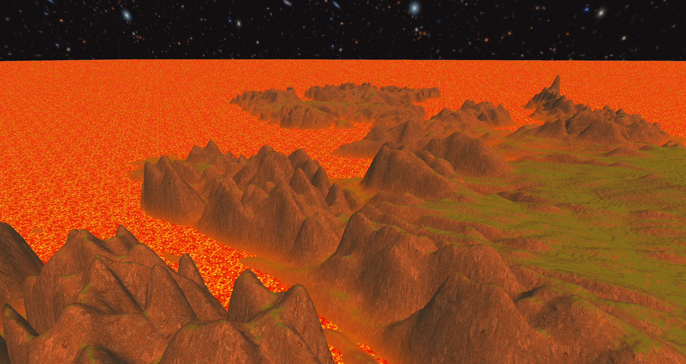
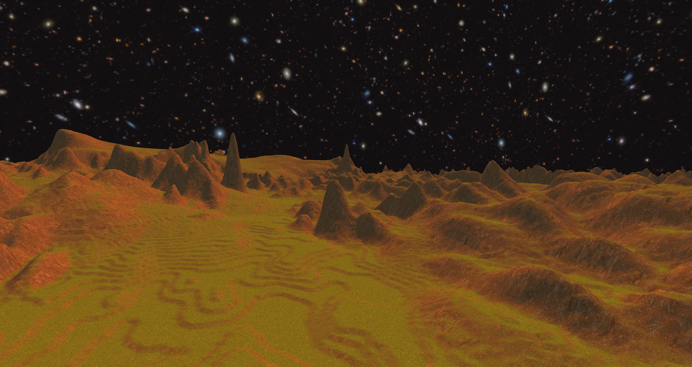
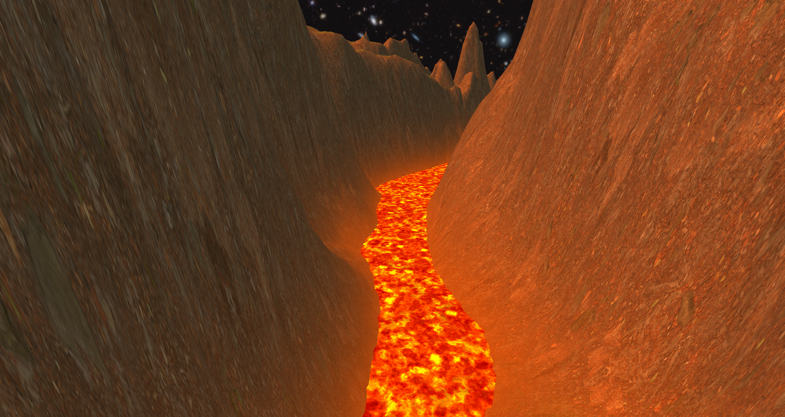
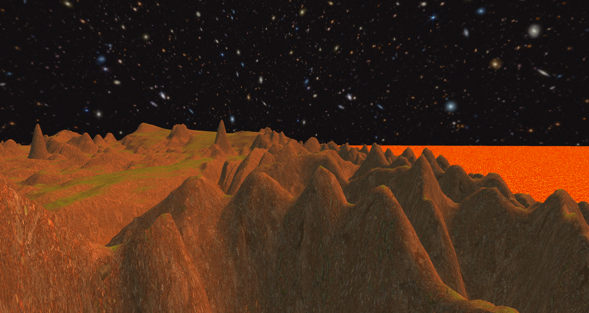
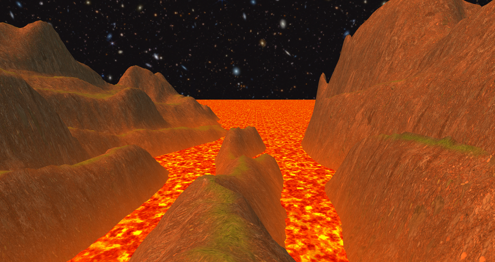
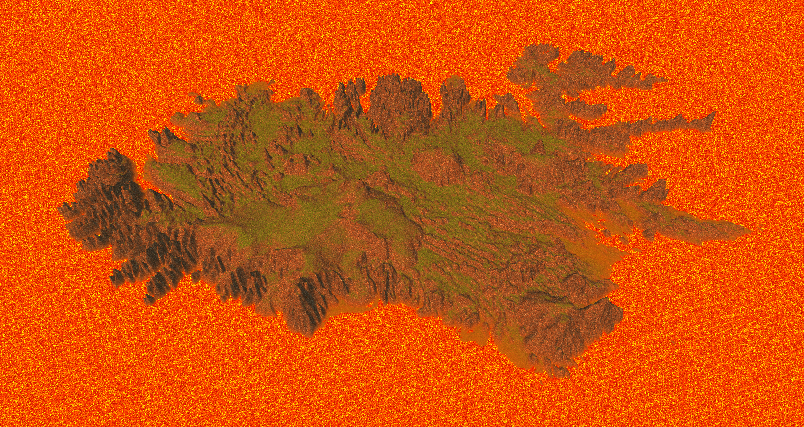
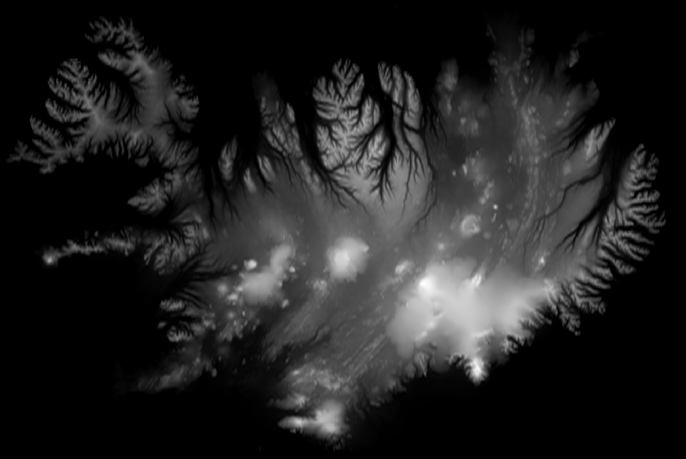

# Terrain with blended textures and skybox

Entry for the CG competition by Herre Torensma (S5629969). The project was done alone.

Build instructions can be found in INSTALL.md.
To execute go into the build folder and run TerrainDemo.

You can fly around the world using WASD (I'm sorry if you have a weird keyboard layout) and the mouse.

You may notice that the terrain is a mirrored version of Iceland (this is no coincidence).

## Screenshots

In the below screenshot you can clearly see the individual 'levels' of relief, which is where the grayscale difference between two pixels in the heightmap are close to or equal to 1.

Mirrored Iceland

The heightmap used to generate the terrain geometry:

Each pixel has a grayscale value of 0 - 255 which are the y coordinates (although scaled) of the vertices in the terrain geometry.

## About the code
The code was based off the second OpenGL assignment, changed significantly to fit my needs.

Inspired by this video: [YouTube - My first 3D game using OpenGL + Glut (Extended)](https://www.youtube.com/watch?v=aviL3HX3UEc&list=PL9IBkhlWvCBvZEhsc3ewJB9Q7A3WUoztZ&index=18)

The terrain loading was implemented following this article: [LearnOpenGL - Tessellation Chapter I: Rendering Terrain using Height Maps](https://learnopengl.com/Guest-Articles/2021/Tessellation/Height-map)

The camera implementation was based on this: [LearnOpenGL - Camera](https://learnopengl.com/Getting-started/Camera)

And the skybox: [LearnOpenGL - Cubemaps](https://learnopengl.com/Advanced-OpenGL/Cubemaps)

If I had more time I would have cleaned up the code, and made it more modular. In this version there are a lot of hardcoded values which I didn't bother to clean up because of time constraints.

The fragments of the terrain are mixed based on their steepness. 'Perfectly vertical' fragments have a rock texture and 'perfectly horizontal' fragments have a grass texture, and everything in between is interpolated. An orangeness is also added based on their y position.

## Experience making it
One point of frustration was the requirement to use the Qt6 library, which was a bit overkill for my purposes, because I didn't need any GUI. I was also not very used to working with C++ so my attempts to make the code cleaner fell short.

Overall I really enjoyed working on this project, and it taught me some new OpenGL techniques and gave me a lot of practice, and I am pretty happy with the end result.
